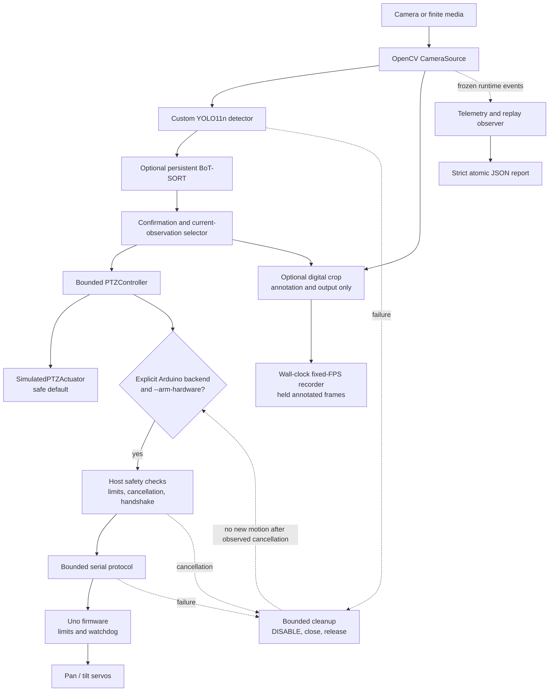

# Architecture

## Deployment boundary

The optional container layer packages the existing composition without moving
hardware ownership out of its interfaces. Replay exposes no devices and uses
simulated actuation. The profile-gated hardware template maps only explicit
camera and serial paths and retains the runtime's `--arm-hardware` gate. A
read-only preflight checks files, imports, CUDA availability, and supplied
device path existence without opening a camera, serial transport, detector, or
actuator. See [deployment and rollback](deployment.md).

## Responsibility split



The Arduino path is unavailable unless the explicit gate is satisfied. The
diagram describes implemented software boundaries. Controlled tracking has
provided camera, serial, servo, and recorded-demo observations, while a
watchdog-disconnect experiment and longer soak evidence remain separate. The
watchdog is a communication fallback, not an emergency stop.

```text
CameraSource -> Detector -> TargetSelector -> PTZController -> Actuator
     |                                                        |
synthetic/OpenCV                                  simulated (safe default)
Synthetic/YOLO detector                           explicitly armed Arduino serial
```

The Ubuntu laptop owns all image processing, target policy, control calculations, telemetry, and serial transport. The Arduino Uno is a narrow safety boundary: it receives validated pan/tilt commands, applies local limits, and drives two SG90 servos.

`src/marine_ptz/types.py` contains the stable values shared across layers.
`Frame.image` is opaque and optional: synthetic frames remain lightweight,
while OpenCV frames carry NumPy arrays without importing NumPy in the base
package. Image payloads are excluded from frame equality, hashing, and repr;
the capture metadata defines frame value equality. `interfaces.py` contains
dependency-inversion boundaries. Synthetic components are composed by
`demo.py`. `vision_cli.py` is the single real-vision composition root for
OpenCV capture, Ultralytics detection, marine selection, the existing
controller, telemetry, and either simulated or explicitly armed serial
actuation. Backend construction is centralized rather than spread through the
tracking loop. `concurrent_runtime.py` contains only hardware-neutral packet,
capacity-one channel, failure-mailbox, and metrics primitives; the composition
and safety boundaries remain in `vision_cli.py`.

## Data flow

1. `CameraSource.read()` produces a timestamped `Frame`.
2. `Detector.detect()` produces zero or more `Detection` values.
3. `TargetSelector.select()` chooses one `Target`, or no target.
4. `PTZController.command_for()` produces a bounded absolute `PTZCommand`.
5. `Actuator.apply()` sends that command to a simulated or physical mechanism.
6. Optional digital zoom transforms the selected overlay and a bounded crop for
   display/recording only; it never feeds detector or controller input.

## BoT-SORT ownership and target-state boundary

The real detector has two explicit modes. With `tracker_backend: none`, each
call invokes `model.predict(...)` and returns ordinary detections without track
IDs. With `tracker_backend: botsort`, each call invokes
`model.track(..., persist=True, tracker=<configured-yaml>)`. The same
`UltralyticsDetector` instance owns the model and BoT-SORT state for the source
lifetime. In concurrent mode the inference worker alone constructs, warms,
synchronizes, and calls that instance; neither the capture worker nor the main
control context calls YOLO, CUDA, `model.track()`, or tracker state. Separate
runtime detector instances therefore have separate model/tracker ownership.

The checked-in BoT-SORT policy admits current detections at a support/input
confidence of 0.20 while requiring the configured detection threshold (0.60 in
the hardware configuration) for acquisition. ReID is disabled and no second
model is loaded. BoT-SORT contributes a current track ID; it does not select a
control target or authorize actuation.

`MarineTargetSelector` applies the policy boundary after detection:

1. a new ID must satisfy the acquisition threshold on two distinct current
   frames by default;
2. once locked, only a valid current detector result with that same ID returns
   a `Target`;
3. if support disappears, the selector protects the locked identity for up to
   0.30 seconds by default but returns no target coordinates;
4. a different visible ID cannot take over during that protected interval;
5. after expiry, the old lock is released and any candidate must pass the same
   confirmation process; and
6. a changed ID during acquisition resets the confirmation count.

The unsupported state is intentionally identity-only. No cached box, Kalman
prediction, or tracker-only coordinate reaches digital zoom or the controller.
Fresh zero-detection results therefore use the configured lost-target policy.
A concurrent result that is unhealthy or older than its 0.5-second default
freshness threshold is rejected before selector/controller advancement and
enters the existing failure/disable path.

Capacity-one frame and detection channels reinforce this contract: an unread
older item is replaced by the newest item instead of forming a FIFO backlog.
The main context renders new results as available and advances the selector and
controller only at an actual scheduled control opportunity. BoT-SORT can still
switch IDs, lose an object under occlusion, or associate similar objects; its
behavior depends on detector quality and tracker tuning, and long-term
re-identification is not guaranteed.

The detector, selector, controller, and actuator always operate on the original
full-frame pixels. `DigitalZoomController` is pure smoothing/geometry state
downstream of actuation. It estimates magnification from selected-box size,
clamps to 1.0x through the CLI maximum (2.0x by default), keeps the crop within
the frame, and eases back toward the full-frame view on target loss. Display and
recording receive the same newly rendered annotation. The recorder maps those
unique processed frames onto a fixed encoded-FPS timeline using monotonic
timestamps; repeated encoded slots hold the previous annotation and never feed
back into detection, control, telemetry, or display.

For physical actuation the startup order is fixed:

1. parse and validate configuration and CLI interlocks;
2. construct the OpenCV source and Ultralytics model;
3. construct selection/control policy, validate one frame, complete first
   inference, and initialize requested display/output resources;
4. open serial and complete correlated `HELLO`/`READY`/`DISABLE`;
5. call `ENABLE` only when the backend is `arduino_serial` and
   `--arm-hardware` was supplied; and
6. enter the loop.

Camera or model construction failure therefore occurs before serial opening or
servo enablement. A serial handshake failure closes resources without calling
`ENABLE`.

The proportional controller applies per-axis pixel deadbands, normalized proportional gain, maximum step limits, and servo-angle limits. Positive image x/y error increases logical pan/tilt. `ArduinoSerialActuator` maps those logical values through per-axis directions and offsets to integer physical degrees. Physical calibration established that both installed axes use `physical = -logical + 180`, preserving neutral 90 while reversing direction. A target below center raises logical tilt but commands a lower physical angle, which points the camera downward; a target above center does the reverse. The equivalent pan inversion makes camera motion follow horizontal image error. Logical and physical limits are verified at 75–105 on both axes. The host checks logical and physical limits; firmware independently rejects anything outside compile-time limits. Lost-target policy remains in the controller.

The serial boundary is split into a hardware-free codec/framer, a small
`SerialTransport` protocol, a deterministic firmware state model, and the
actuator. Pyserial is imported only when `PySerialTransport.open()` is called.
Opening an Uno port may trigger its normal auto-reset, so startup uses a
separate bounded boot grace and handshake deadline. Sequence-zero startup
`READY` is informational; a correlated `READY` and then correlated `DISABLE`
are required before the actuator reports connected.

Ordinary transport reads, ignored responses, writes, and retries are bounded;
there is no background thread or blocking output drain. Local write completion
means a frame reached the OS/driver; its correlated response is the end-to-end
confirmation. After a possibly applied command loses its acknowledgement, the
actuator keeps its last confirmed coordinates, reports position uncertainty,
and blocks further motion until explicit recovery. A semantically impossible
ACK or STATUS faults and disconnects the trusted local session without claiming
the physical firmware is disabled; a successful re-handshake plus correlated
`DISABLE` is required before motion can resume. The Arduino owns final range
enforcement, servo attachment, and the communication watchdog. Its loop bounds
RX bytes and commands, evaluates the watchdog before and after serial work, and
uses one aggregate fixed-buffer CRLF TX budget after RX processing.

The Uno sketch is also a reproducible compile-only CI boundary: a separate
read-only Ubuntu job installs the pinned Arduino CLI, AVR core, and Servo
library before compiling the production sketch with all warnings. It neither
uploads firmware nor accesses serial hardware; compiled output remains in the
runner temporary directory. This validates toolchain compatibility, not
physical behavior.

For `CameraSource.read()`, `None` means evidence indicates normal end-of-file
for finite media. The OpenCV source compares usable frame-count and position
metadata when available. Unknown-length media failures raise `MediaReadError`;
recognized image files finish normally after their single successful frame.
Live-camera read failure raises `CameraReadError`. Every terminal read path
releases the capture, and OpenCV validates grayscale or supported channel
shapes at the capture boundary. Optional vision libraries and model weights
are loaded only when a real vision component is constructed.

Runtime shutdown is coordinated in ordinary control flow. A local signal
handler records only a termination request; the loop performs cleanup. Motion
shutdown is attempted first, then the actuator transport, writer, source, and
display resources are closed idempotently. Finite-media EOF, frame limits, and
display `q` return CLI status 0. SIGINT and SIGTERM are operationally expected
shutdown requests after bounded cleanup, but `main()` returns their conventional
Unix statuses 130 and 143. A component-raised `OperationCancelled` is normal
only when the shared termination predicate is true; otherwise it is an
actionable failure chained to the original exception and returns status 2.
Detection, malformed frame, camera, serial, actuator, annotation, writer, and
other unexpected failures also return status 2. `run_vision()` returns a
processed-frame count only; `main()` owns the process-status contract. Cleanup
failures are reported alongside the primary failure rather than silently
replacing it. The same precedence applies to runtime observers: a control-path
failure remains authoritative, while a processing-end observer failure and any
cleanup failures are retained in a Python-3.10-compatible
`RuntimeSecondaryFailures` chained diagnostic. If normal completion or an
otherwise expected signal cancellation reaches a failing processing-end
observer, that observer failure is the lifecycle failure and returns status 2;
no replay completion report is written.

Cancellation is checked after source/model construction, before serial open,
after the serial `HELLO`/`READY`/`DISABLE` handshake, immediately before
`ENABLE`, and before/after every capture, inference, selection, control, and
dispatch boundary. `ArduinoSerialActuator` receives the runtime's predicate
without changing the base `Actuator` protocol. It observes cancellation before
and after its one bounded rate-limit sleep and immediately before an `ENABLE`,
`CENTER`, or `SET` transport write. Once a boundary observes cancellation, no
new `ENABLE` or `SET` is initiated. A write already handed to the serial/OS
layer may still complete; ordinary control flow then attempts bounded
`DISABLE` and resource cleanup.

Hardware-mode initialization prepares one frame before serial is opened. That
pre-enable phase validates capture dimensions, performs the cold first YOLO
prediction, selects any target, and initializes requested display/output
resources. Only then does the runtime construct/open the actuator, complete the
detached handshake, and send `ENABLE`. Its first `SET` is an immediate bounded
neutral/hold command; the prepared detection is applied on the next configured
command-rate slot. Empty detections and `hold` target loss continue to resend
the current safe pose, so normal frame processing refreshes the watchdog without
inventing motion.

The verified `single` path remains the default and rollback implementation. The
opt-in `concurrent` path uses one non-daemon capture worker, one non-daemon
inference worker, the main control/serial/GUI context, and an optional
non-daemon recorder worker. OpenCV capture and PyTorch/CUDA inference spend most
of their expensive work in native code, so Python threads allow those stages to
overlap without introducing multiprocessing ownership or serialization.

Capture and detection-result channels each retain only their newest value.
Capacity one is intentional: a real-time controller benefits from current
evidence, not a lossless backlog of increasingly stale frames. Finite OpenCV
video must provide a validated positive declared FPS. Its capture worker reads
one validation frame, then waits on an explicit inference-worker readiness
barrier while that worker constructs the detector, performs representative
warm-up, and synchronizes CUDA when the detector supports it. Only after this
barrier does finite-video capture start a monotonic, deadline-based playback
schedule. Missed deadlines are skipped without catch-up bursts or cumulative
drift. Live cameras are never artificially paced.

Packets carry capture and inference monotonic timestamps, immutable source/FPS
metadata, and explicit healthy inference state. A successful empty detection
tuple is healthy and drives the configured lost-target policy. Normal finite
EOF closes capture publication without setting the fault/cancellation event;
the last capacity-one frame, any in-flight inference, the final main-loop
render/control observation, and the final recorder submission drain before
bounded cleanup. A decode/read failure remains a hard worker failure, while
operator cancellation and faults retain immediate bounded shutdown. The main
context consumes and renders each newly available latest result before checking
the 10 Hz control deadline.
Only a due slot selects a target and advances controller state. Its next
deadline is anchored after the acknowledged command completes, so a delayed
command skips missed slots instead of bursting or immediately re-entering the
actuator's sleep-based rate limiter. The due slot uses only the newest result
younger than the configured freshness limit. If perception fails, stops, or
becomes stale, cancellation prevents new motion commands and cleanup attempts
`DISABLE`; no independent command keepalive is allowed to hide the stalled
perception pipeline. The recorder has its own capacity-one handoff and retains
the existing monotonic wall-clock frame holding policy, so offered, consumed,
dropped, encoded, and held/duplicate frame counts remain distinct from unique
inference, display cadence, and faults. Concurrent metrics also identify source
kind, declared FPS, pacing status, normal EOF versus capture fault, stage counts,
and shutdown duration; rates with fewer than two timestamps remain null rather
than implying a measured FPS.

Every worker reports its first failure to the main context, closes its outbound
channel, and observes one shared event. Normal threads are joined with a bounded
deadline; daemon threads are not used as a shutdown substitute. The capture
worker owns construction, reads, and normal release of its source; only the
bounded shutdown escape hatch may call an idempotent source close to unblock a
stuck native read. The inference worker alone constructs and invokes its model,
and only the main context constructs and calls the actuator. A physical
concurrent run established the worker topology, approximately 30 Hz inference,
approximately 10 Hz commands, watchdog stability, and bounded shutdown, but
also exposed control-coupled 10 Hz rendering. The corrected render/control
schedule is hardware-free tested and still requires controlled physical
revalidation. Use `single` as the rollback until that evidence is recorded.

Offline replay does not duplicate this loop. `run_vision()` has an optional
observer that receives frozen start, applied-frame, processing-end, and normal
completion snapshots. No snapshot exposes a source, detector, actuator, serial
transport, image, mutable detection container, or callback. The processing-end
snapshot is emitted immediately when the frame loop ends and before bounded
cleanup, so replay FPS, command rate, and acquisition timing exclude cleanup
duration. `replay.py` consumes those snapshots for finite-media metrics and
feeds the existing strict atomic report writer from `benchmark.py`. The replay CLI fixes actuation to
`SimulatedPTZActuator`, rejects live/serial options, and uses the regular
source/detector factories only when invoked by an operator with local media and
a model. Replay report serialization replaces local CLI/configuration paths
with basename-only markers while retaining generic URL/secret redaction. The
observer does not own vision, selection, controller, or actuator policy.

Dataset preparation is a separate, local-only path and never enters the live
tracking composition. Camera recording and finite-clip extraction import
OpenCV only when their operator commands run. Pure label validation and
whole-recording-session splitting live in `marine_ptz.dataset`; training and
held-out evaluation are thin, lazy Ultralytics wrappers. The checked-in schema
defines exactly class `marine_target`, while all images, labels, recordings,
weights, predictions, and runs remain ignored. No dataset tool imports or opens
the serial/actuator boundary.

Held-out evaluation classifies test images from their YOLO labels. Nonempty
labels form the positive set; manually reviewed zero-byte labels form the
negative set. Standard Ultralytics box metrics remain unchanged, while a
separate thresholded pass reports negative-image false positives and saves
annotated examples only when they occur. The wrapper imports Ultralytics only
when invoked.

Private Platform exports enter only through the local NDJSON importer. It
validates the one-class metadata and normalized boxes, resolves annotated rows
to original staging images by unique exact basename, and atomically publishes a
new session-preserving staging tree. Embedded export URLs are never fetched.
The existing splitter consumes that new tree; the partially annotated original
extraction tree is not a valid substitute.
